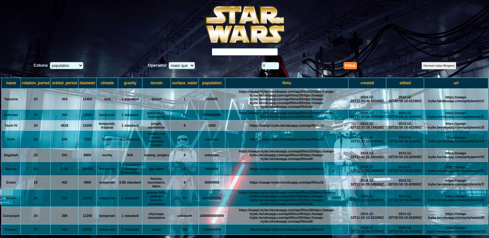

#  Projeto Star Wars 

<!-- Olá, Tryber!

Esse é apenas um arquivo inicial para o README do seu projeto.

É essencial que você preencha esse documento por conta própria, ok?

Não deixe de usar nossas dicas de escrita de README de projetos, e deixe sua criatividade brilhar!

⚠️ IMPORTANTE: você precisa deixar nítido:
- quais arquivos/pastas foram desenvolvidos por você; 
- quais arquivos/pastas foram desenvolvidos por outra pessoa estudante;
- quais arquivos/pastas foram desenvolvidos pela Trybe.

-->

## Boas vindas ao repositório do projeto Starwars Planets
## Search em context api e hooks!

Neste projeto foi desenvolvido uma lista com filtros de planetas do universo de Star Wars usando Context API e Hooks para controlar os estados globais.

### Habilidades Trabalhadas no Projeto

* Utilizar a Context API do React para gerenciar estado.
* Utilizar o React Hook useState;
* Utilizar o React Hook useContext;
* Utilizar o React Hook useEffect;
* Criar React Hooks customizados.

### Linguagens 

* Javascript com React
* Html
* Css

### Acesse a aplicação no link abaixo
[Projeto Star Wars](https://project-star-wars-trybe.netlify.app/)

### Para executar o projeto em sua máquina

* Clone este repositório
* Entre na pasta clonada
* Instale as dependencias (**npm install**)
* Execute a aplicação (**npm start**)